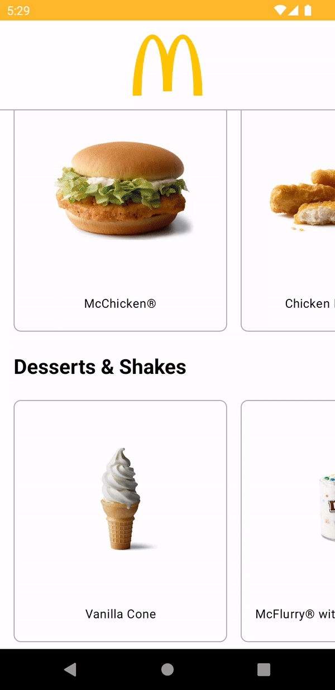

# McDonalds Menu

App that displays the McDonalds menu. Check this branch for Compose implementation.

## Package Structure and Software Design Patterns

Monolithic app that uses feature layer package structure approach. It has each layer package isolated one from the other one, so it makes it highly [modularizable](https://medium.com/proandroiddev/the-abc-of-modularization-for-android-in-2021-e7b3fbe29fca) if necessary.

It uses [MVVM](https://medium.com/proandroiddev/understanding-mvvm-pattern-for-android-in-2021-98b155b37b54) as software design patter at presentation layer level.

In the upper layers such as Domain & Data, it uses the Repository pattern for abstract and obtain the data from the API service.

For provide dependencies it uses "manual" Dependency Injection as it is a small project that does not require any extra library for provide deps. (The same choice why this wasn't modularized at first glance).

## Tech Stack
- Application entirely written in [Kotlin](https://kotlinlang.org)
- Asynchronous processing using [Coroutines](https://kotlin.github.io/kotlinx.coroutines/)
- HttpClient [Retrofit](https://github.com/square/retrofit)
- State stream management using [StateFlow](https://developer.android.com/kotlin/flow/stateflow-and-sharedflow)
- Jetpack [ViewModel](https://developer.android.com/topic/libraries/architecture/viewmodel)
- Uses [JUnit4](https://developer.android.com/training/testing/junit-rules) for unit testing
- Uses [Turbine](https://github.com/cashapp/turbine) for testing flows
- Uses [Mockk](https://mockk.io) for mock behaviour while unit testing

## 📃 License

```
Copyright 2022 Christopher Elias

Licensed under the Apache License, Version 2.0 (the "License");
you may not use this file except in compliance with the License.
You may obtain a copy of the License at

    http://www.apache.org/licenses/LICENSE-2.0

Unless required by applicable law or agreed to in writing, software
distributed under the License is distributed on an "AS IS" BASIS,
WITHOUT WARRANTIES OR CONDITIONS OF ANY KIND, either express or implied.
See the License for the specific language governing permissions and
limitations under the License.
```
